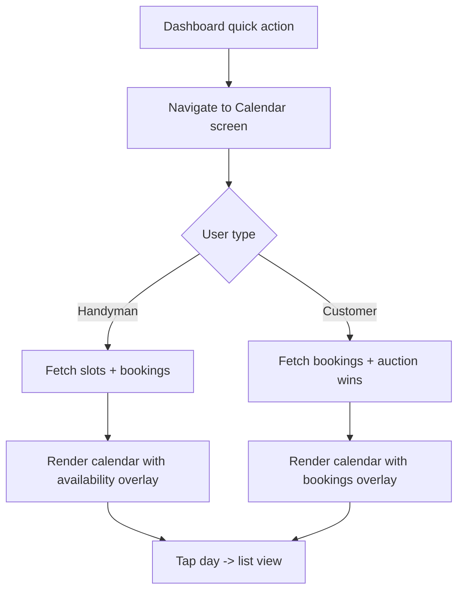
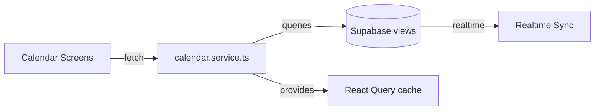

# Calendar Experience Spec

## Overview
Provide shared calendar views and navigation for both customers and handymen to review bookings and availability within a unified interface.

## Goals
- Month/week switchable calendar component with role-based overlays.
- Handyman calendar: highlight availability slots, confirmed bookings, auction outcomes.
- Customer calendar: highlight upcoming bookings and auction wins.

## Assumptions
- Rely on in-app calendar only; external sync handled later.
- Timezone conversions handled by existing utilities.

## UI Components
- `CalendarView` (shared base component).
- `HandymanCalendarScreen` and `CustomerCalendarScreen` wrappers.
- Filters for region/service type.

## Flow Diagram

## Architecture Diagram

## Data Requirements
- Create Supabase view `handyman_calendar_view` joining `time_slots` + `bookings`.
- Create `customer_calendar_view` for bookings + auction wins.
- Ensure indexes on date fields for range queries.

## Interactions
- Tap day -> bottom sheet with detailed items and actions.
- Provide quick filter for service category.

## Accessibility
- Ensure calendar cells support screen readers with day/date and availability summary.

## Acceptance Criteria
- Calendar available from both dashboards via `View Calendar` button.
- Switching month/week persists via context.
- Real-time updates refresh entries without full reload.

## Testing
- Unit tests for calendar service date range queries.
- Component tests verifying correct overlays per role.
- Detox: Navigate to calendar, open detail, perform booking action.