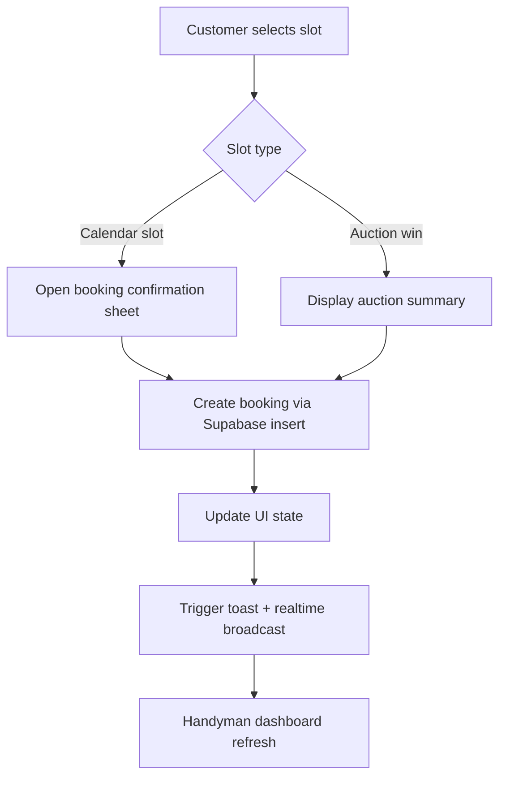
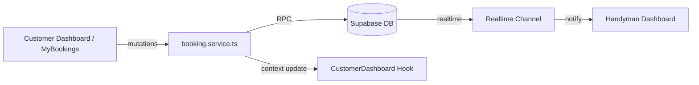

# Customer Booking Management Spec

## Overview
Define the end-to-end booking experience for customers, covering discovery, booking creation, modification, and cancellation for both calendar slots and auction winnings. The feature must respect Swiss market rules (CHF, timezone) and integrate with existing Supabase tables (`time_slots`, `bookings`, `auctions`).

## Goals
- Customers can create bookings directly from dashboard quick actions and slot listings.
- Customers can view, reschedule, or cancel existing bookings with clear status updates.
- Booking actions trigger real-time updates for the handyman and participating customers.

## Non-Goals
- Payment capture (covered in `payment-transaction-spec.md`).
- Calendar synchronization outside the app (handled in `calendar-experience-spec.md`).

## User Stories
- As a customer, I can tap `Book` from available slots to confirm a booking with default CHF pricing.
- As a customer, I can reschedule a booking to a new slot if the handyman exposes availability.
- As a customer, I receive confirmation and toast feedback when booking actions succeed or fail.

## Data Model
- Reuse Supabase tables: `bookings`, `time_slots`, `auctions`.
- Add columns if missing: `bookings.cancellation_reason`, `bookings.rescheduled_from_booking_id`.
- Ensure RLS: customers only mutate their bookings; handymen manage bookings tied to their slots.

## UI/UX Requirements
- Update `CustomerDashboard` cards with actionable CTA buttons.
- Create dedicated `MyBookingsScreen` leveraging `Card` components with glass theme support when active.
- Include toast messages via `ToastContext` for success/error states.

## Flow Diagram

## Architecture Diagram

## API Contracts
- `booking.service.ts`
  - `createBooking(slotId, customerId, source)` returns `Booking`.
  - `updateBookingStatus(bookingId, status, metadata)` handles cancel/reschedule.
  - `listBookings(customerId, limit)` returns ordered list.

## Validation & Business Rules
- Respect business hours (08:00-18:00) using `timezone` utils.
- Minimum booking duration matches slot duration; prevent double booking via database constraint.
- Enforce CHF formatting in UI using `formatCHF`.

## Acceptance Criteria
- Booking from `CustomerDashboard` works for both slot and auction entries.
- Reschedule flow updates old booking to `canceled` with reference to new booking.
- Real-time notification is emitted to the handyman via existing notification service.

## Testing Strategy
- Unit tests for booking service covering create/reschedule/cancel scenarios.
- Component tests for `CustomerDashboard` quick actions.
- Detox scenario: customer books slot, sees confirmation, and booking appears in list.