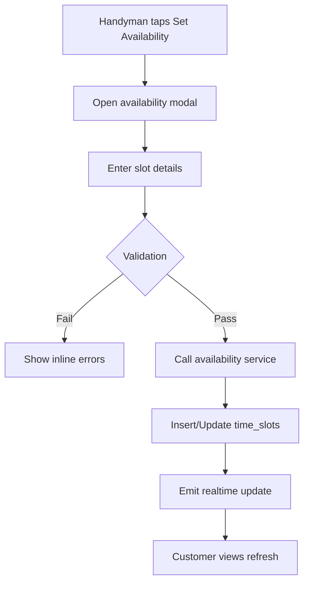
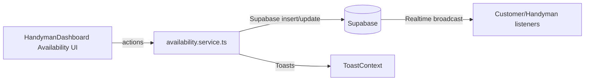

# Handyman Availability Management Spec

## Overview
Design the UI and backend interactions that enable handymen to create, edit, and block time slots directly from the dashboard while ensuring customers see up-to-date availability.

## Goals
- Provide an in-app availability editor accessible from `HandymanDashboard`.
- Support slot CRUD operations with immediate customer-facing updates.
- Ensure Swiss business hour validation and prevent overlaps.

## Scope
- Availability modal/screen with calendar picker and recurring options (single-slot MVP).
- Quick toggles for marking time slots as unavailable.
- Realtime sync to refresh customer data views.

## Out of Scope
- External calendar sync (handled separately).
- Automated recurring slots (future enhancement).

## User Stories
- As a handyman, I can create a new slot specifying start/end time, CHF price, and region.
- As a handyman, I can edit or cancel upcoming slots.
- As a handyman, I can block off a slot that is no longer available.

## Data Model
- Table: `time_slots` (existing) with fields `status`, `price_chf`, `region`.
- Add optional `notes` column for handyman comments.

## UI Requirements
- `Set Availability` button opens modal with `Card` layout.
- Inputs: date picker, start/end time, price (CHF), region dropdown, description optional.
- Use tailwind/nativewind tokens for spacing.

## Flow Diagram

## Architecture Diagram

## API Contracts
- `availability.service.ts`
  - `createSlot(handymanId, payload)` -> `TimeSlot`.
  - `updateSlot(slotId, payload)` -> `TimeSlot`.
  - `deleteSlot(slotId)` -> `{ success: boolean }`.

## Validation Rules
- Start < End; duration between 30 mins and 8 hours.
- Price >= CHF 20; increments of CHF 5 recommended.
- Overlap checks on server using SQL constraints or RPC.

## Acceptance Criteria
- Handyman can create slots and immediately see them in dashboard.
- Customers see new slots within 5 seconds (realtime or fallback polling).
- Cancelled slots no longer appear in customer search results.

## Testing
- Unit tests for availability service validations.
- Integration test to ensure overlap prevention.
- Detox: handyman creates slot, customer list shows new slot.