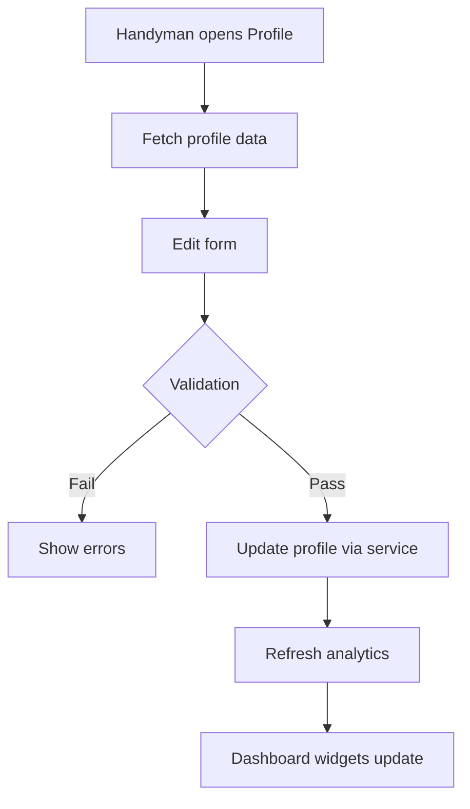
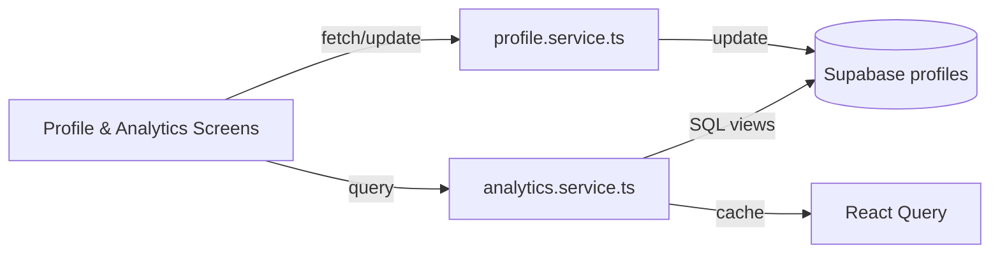

# Handyman Profile & Analytics Spec

## Overview
Enhance handyman tooling by allowing profile updates (rates, skills, regions) and delivering advanced analytics dashboards that combine booking and auction data.

## Goals
- Editable profile form with validation for CHF rates and service regions.
- Analytics widgets showing revenue trends, booking vs auction mix, and conversion metrics.
- Ensure data accuracy by aggregating across bookings and auctions.

## Scope
- Profile screen accessible from `HandymanDashboard`.
- Extend `useAuctionAnalytics` and create complementary booking analytics hook.
- Visual components using existing `Card` styles.

## Data Requirements
- Tables: `handyman_profiles`, `bookings`, `auctions`, `auction_bids`.
- Add computed Supabase view `handyman_revenue_summary` with CHF totals per period.

## Flow Diagram

## Architecture Diagram

## Validation Rules
- Hourly rate >= CHF 20, increments of CHF 5.
- Regions limited to Swiss cantons; store as enum or validated list.
- Skills limited to predefined taxonomy.

## Analytics Metrics
- Monthly revenue (bookings + auctions).
- Auction conversion rate (bids leading to wins).
- Booking lead time (slot creation to booking confirmation).

## Acceptance Criteria
- Profile updates persist and reflect on dashboards without reload.
- Analytics cards show accurate CHF sums compared against sample data.
- Edge cases (no bookings, no auctions) handled gracefully.

## Testing
- Unit tests for profile service validation and analytics aggregation.
- Integration test verifying Supabase views return expected schema.
- Detox: update profile rate, confirm dashboard reflects new value.