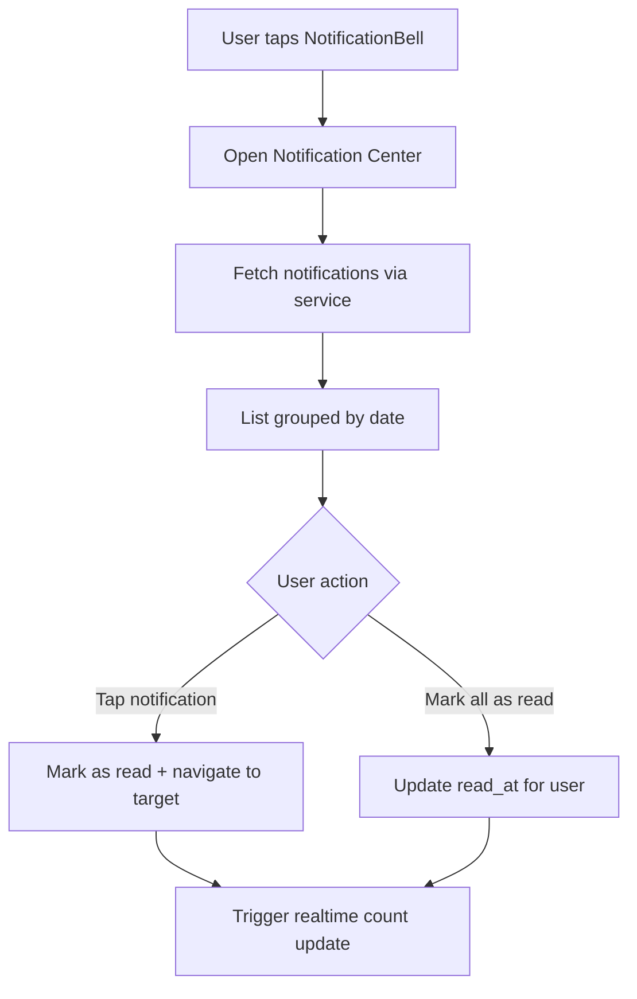
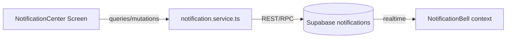

# Notification Center Spec

## Overview
Deliver a full notification center that aggregates booking, auction, and system alerts with read/unread state management and deep links.

## Objectives
- Display notification feed with filters (All, Unread, Bookings, Auctions).
- Allow users to mark notifications as read individually or in bulk.
- Support deep linking into relevant screens (booking detail, auction detail, calendar).

## User Stories
- As a customer, I can view unread notifications and jump to the booking that needs action.
- As a handyman, I can see new booking requests and mark them as handled.
- As any user, I can clear notifications after reviewing them.

## Data Model
- Supabase table `notifications` with fields: id, user_id, type, payload (JSON), read_at, created_at.
- Add index on (user_id, read_at) for quick filters.

## UI Requirements
- `NotificationBell` badge shows unread count.
- `NotificationCenterScreen` uses `Card` components with glass support.
- Provide swipe-to-mark-read and bulk actions.

## Flow Diagram

## Architecture Diagram

## API Contracts
- `notification.service.ts`
  - `list(userId, filters)` -> `Notification[]`.
  - `markRead(notificationId)` -> success.
  - `markAllRead(userId)` -> success.

## Integration Points
- Toasts for actions (e.g., "All notifications marked as read").
- Deep link map: booking -> `MyBookingsScreen`, auction -> `AuctionDetail`, calendar -> `CalendarScreen`.

## Acceptance Criteria
- Notification center loads within 1 second for the last 50 notifications.
- Marking notifications updates badge count instantly via realtime/polling.
- Deep links open the correct screen with provided context (e.g., booking ID).

## Testing Strategy
- Unit tests for notification service filter logic.
- Component tests verifying filter tabs and unread highlighting.
- Detox: open notification center, mark single item read, validate navigation.