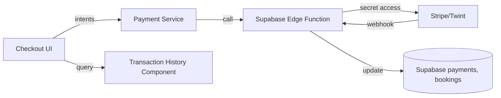
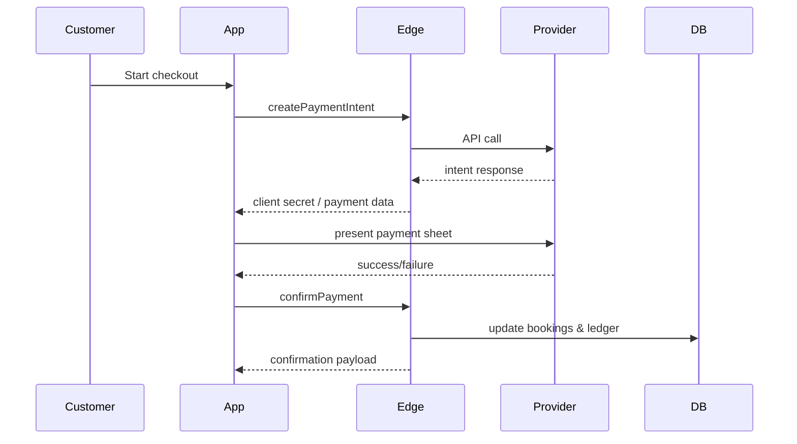

# Payment & Transaction History Spec

## Overview
Introduce payment processing for bookings and auction wins using a Swiss-compliant provider (Stripe Connect or Twint) and expose transaction history to both customers and handymen.

## Goals
- Integrate provider checkout flows for customer payments and handyman payouts.
- Display transaction ledger with CHF formatting and status indicators.
- Store payment metadata securely without exposing secrets in the client.

## Provider Evaluation
- Stripe Connect (preferred for flexibility) vs Twint (local adoption).
- Support test mode credentials in `.env` (client-safe values only).

## Architecture Diagram

## Flow Diagram

## Data Model
- New table `payments` with fields: id, booking_id, customer_id, handyman_id, amount_chf, provider, status, metadata.
- New table `payouts` (for handyman earnings) with status tracking.

## UI Requirements
- Customer: payment confirmation screen and transaction history list.
- Handyman: earnings summary card + detailed ledger.
- Status badges: Pending, Succeeded, Failed, Refunded.

## Security & Compliance
- Sensitive provider keys stored in Supabase Edge or serverless layer.
- Client stores ephemeral keys only.
- Log payment events for audit (GDPR compliance, 90-day retention).

## Acceptance Criteria
- Successful payment updates booking status to `confirmed` and records in ledger.
- Failed payment displays error and leaves booking pending/cancelled appropriately.
- Handyman can view payout status with CHF totals.

## Testing Strategy
- Unit tests for payment service (mock provider responses).
- Integration tests hitting Supabase Edge Functions in staging.
- Detox: simulate successful payment flow (provider test mode).

## Open Questions
- Final provider selection and onboarding timeline.
- Refund policy and triggers.
- Handling of partial payments or deposits.