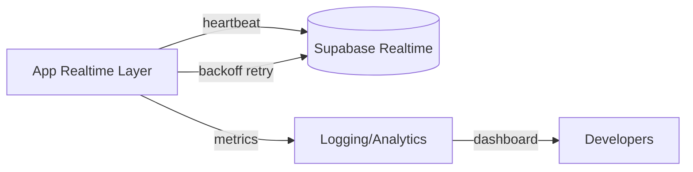
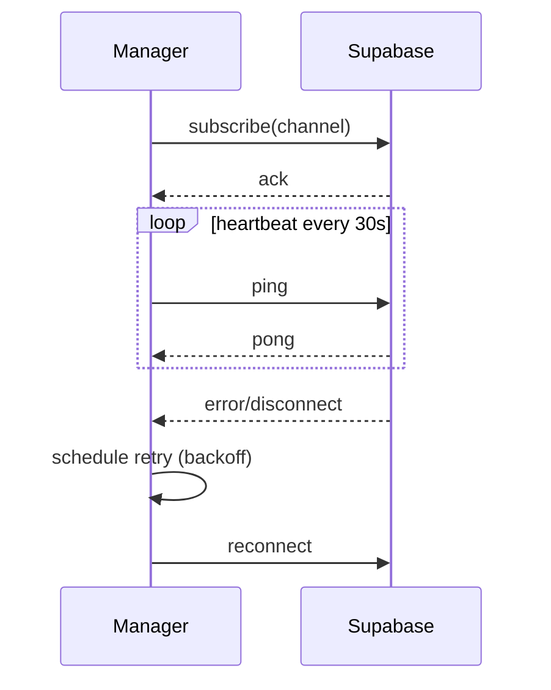

# Realtime Resilience & Observability Spec

## Overview
Improve robustness of realtime features and introduce observability for auction, booking, availability, and notification channels.

## Goals
- Monitor realtime connection health and automatically recover from failures.
- Add logging and metrics for subscription counts and error rates.
- Provide admin visibility into outages via troubleshooting guide updates.

## Scope
- Connection watchdog with exponential backoff.
- Heartbeat checks using lightweight RPC or ping messages.
- Instrumentation hooks that log to Supabase Logs or external service (e.g., Sentry).

## Architecture Diagram

## Flow Diagram

## Implementation Steps
- Extend `RealtimeManager` with heartbeat timer and retry queue.
- Expose event hooks for logging (connected, disconnected, retries).
- Add fallback to fetch latest data after reconnect.

## Observability
- Integrate with `console` + optional Sentry breadcrumb.
- Record metrics: average reconnect attempts, time to recover, missed messages.
- Update `docs/specs/troubleshooting.md` with playbook.

## Acceptance Criteria
- Realtime layer attempts at least 5 retries with increasing delay before surfacing error.
- After network loss, data resync occurs automatically on reconnect.
- Metrics logged for each reconnect attempt.

## Testing
- Unit tests simulating disconnect events.
- Integration tests using mocked Supabase client.
- Manual QA: toggle offline mode in simulator to verify recovery.