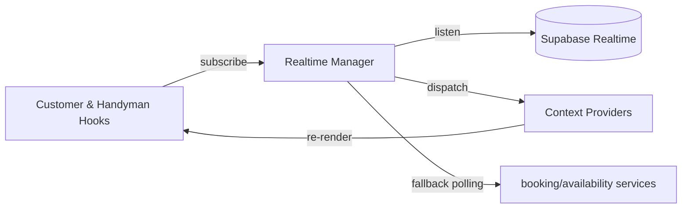
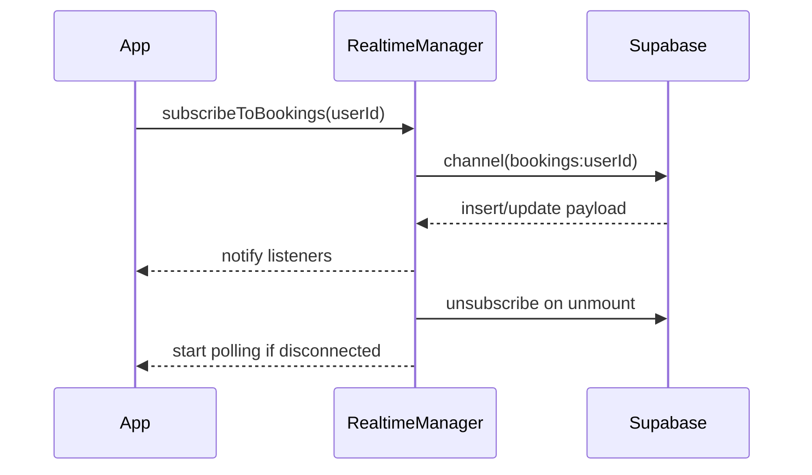

# Booking & Availability Realtime Sync Spec

## Overview
Extend realtime infrastructure beyond auctions to ensure bookings and time slot changes propagate instantly to both customers and handymen.

## Objectives
- Introduce unified realtime channels for `bookings` and `time_slots`.
- Provide resilient fallback polling when realtime disconnects.
- Manage subscription lifecycle to avoid leaks.

## Constraints
- Must comply with Supabase connection limits.
- Reuse existing hooks pattern (`useBidding`).

## Architecture Diagram

## Flow Diagram

## Implementation Plan
- Create `useRealtimeBookings` and `useRealtimeAvailability` hooks.
- Centralize connection handling in `RealtimeManager` singleton.
- Implement exponential backoff for reconnection.

## API Contracts
- `realtime.service.ts`
  - `subscribe(resource, filters, callback)` -> subscription id.
  - `unsubscribe(id)`.
  - `setFallbackPoll(fn)` for resource-level polling.

## Acceptance Criteria
- Booking creation triggers customer and handyman UI updates within 2 seconds.
- Time slot deletion removes slot from customer list without manual refresh.
- When realtime fails, polling continues every 10 seconds until connection restored.

## Testing
- Unit tests mocking Supabase channel events.
- Integration test verifying fallback polling kicks in when channel errors.
- Detox: disable network (if feasible) to confirm polling still shows changes after restore.