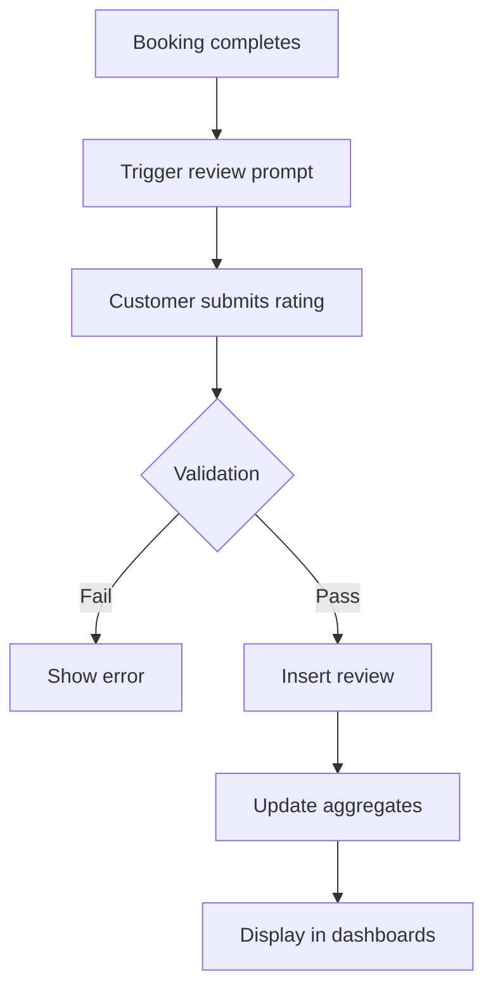
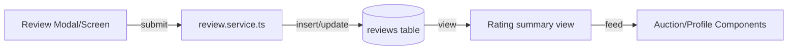

# Reviews & Ratings Spec

## Overview
Enable customers to rate completed jobs and submit reviews, while handymen can view feedback summaries. Ratings influence discovery and analytics.

## Goals
- Collect ratings post-completion with optional written feedback.
- Display aggregate ratings in auction cards and profiles.
- Provide moderation tools to flag inappropriate content.

## Data Model
- New table `reviews` with columns: id, booking_id, customer_id, handyman_id, rating (1-5), comment, status (published, flagged), created_at.
- Add aggregated view `handyman_rating_summary` (avg rating, count).

## Flow Diagram

## Architecture Diagram

## UI Requirements
- Prompt appears after booking marked `completed` (toast + modal).
- Review form: star rating component, optional text (max 500 chars).
- Display average rating and count in `CustomerDashboard` listings and `HandymanDashboard` analytics.

## Moderation
- Add admin-only flag endpoint (future) but include `status` field to allow manual moderation.
- Basic profanity filter client-side using word list.

## Acceptance Criteria
- Review submission available only once per booking.
- Updated rating visible in profiles within 5 seconds.
- Handyman cannot edit customer reviews but can view them.

## Testing
- Unit tests for review service validation.
- Component tests for review prompt logic.
- Detox: complete booking, submit review, verify display.