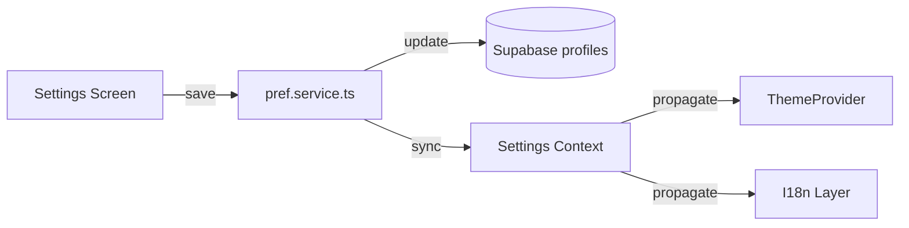

# User Settings & Preferences Spec

## Overview
Create a unified settings experience allowing users to manage notification opt-ins, language preference, and theme selection beyond current light/dark modes.

## Goals
- Expose settings screen accessible from both dashboards.
- Persist preferences in Supabase profile tables and local storage fallback.
- Allow users to toggle push/email notifications, choose UI language, and select theme variants.

## Data Model
- Extend `handyman_profiles` and `customer_profiles` with columns: `language`, `notifications_push`, `notifications_email`, `theme_preference`.
- Provide default values aligned with Swiss market (language = de-CH).

## Flow Diagram
```mermaid
graph TD
    A[User opens Settings] --> B[Fetch current preferences]
    B --> C[Display toggles and dropdowns]
    C --> D[User saves changes]
    D --> E[Update profiles via service]
    E --> F[Update local context (Theme/Language)]
    F --> G[Show toast confirmation]
```

## Architecture Diagram


## UI Requirements
- Use `Card` sections for Notifications, Language, Appearance.
- Provide language options: German (default), French, Italian; future Romansh placeholder.
- Theme toggle: Default, Dark, Glass.

## Acceptance Criteria
- Changing language updates UI strings instantly (requires i18n integration plan).
- Notification toggles persist and affect push subscription logic.
- Theme selection updates `ThemeProvider` without app restart.

## Testing
- Unit tests for preference service ensuring defaults.
- Component tests verifying UI responds to context changes.
- Detox: change settings, restart app, confirm persistence.

## Dependencies
- i18n library selection (e.g., `react-i18next`).
- Push notification opt-in flow updates (NotificationContext).