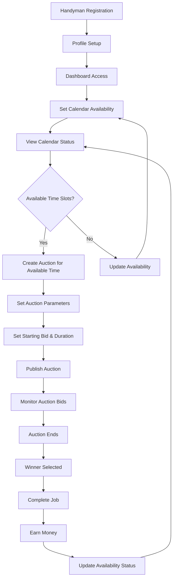
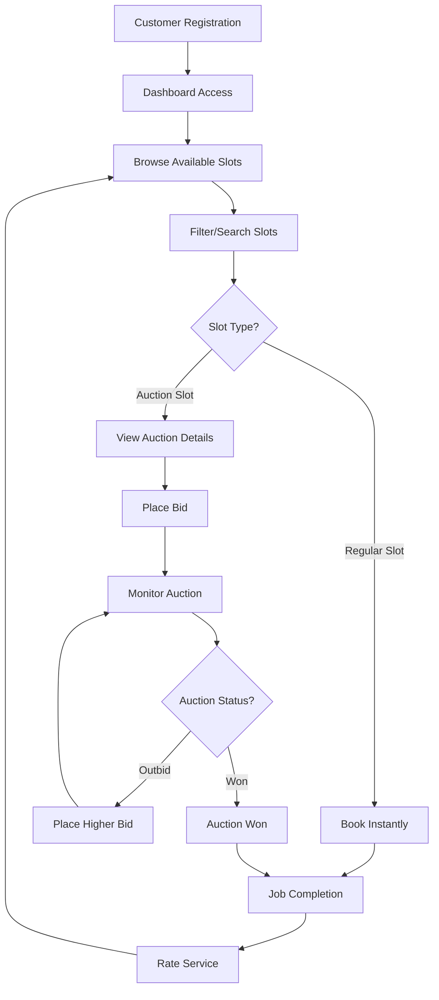
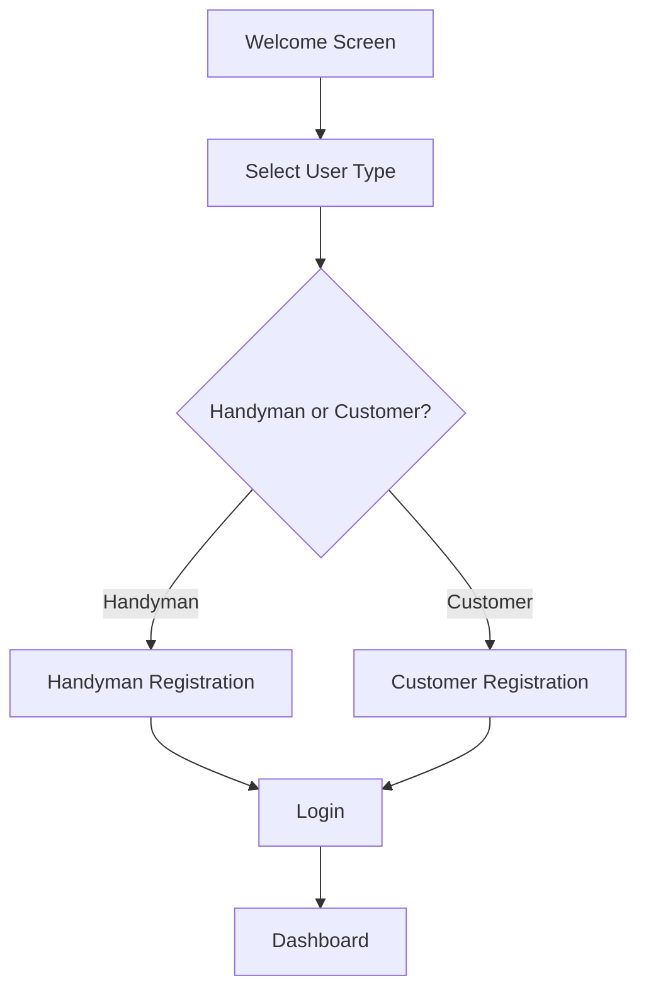
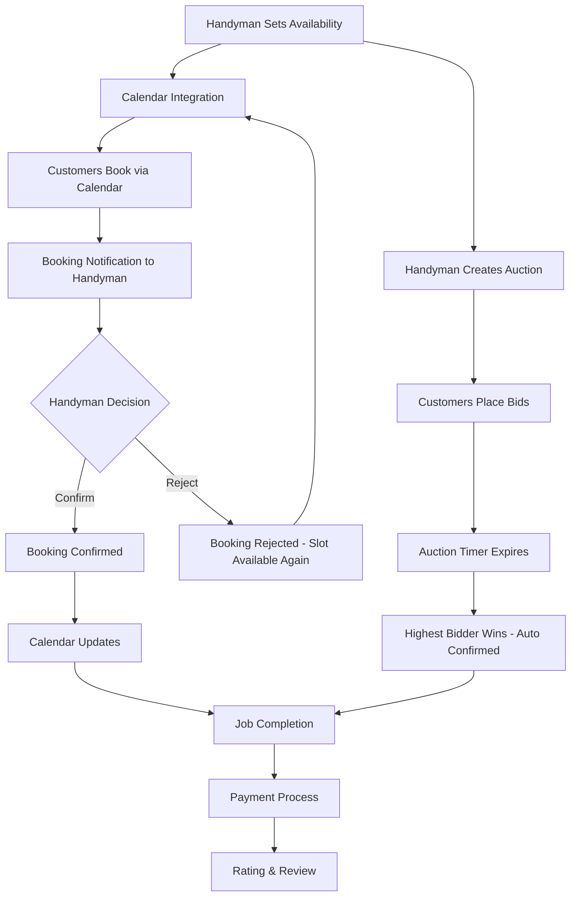
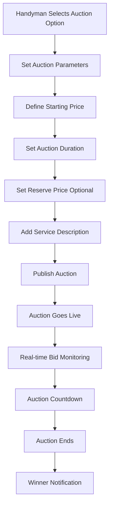
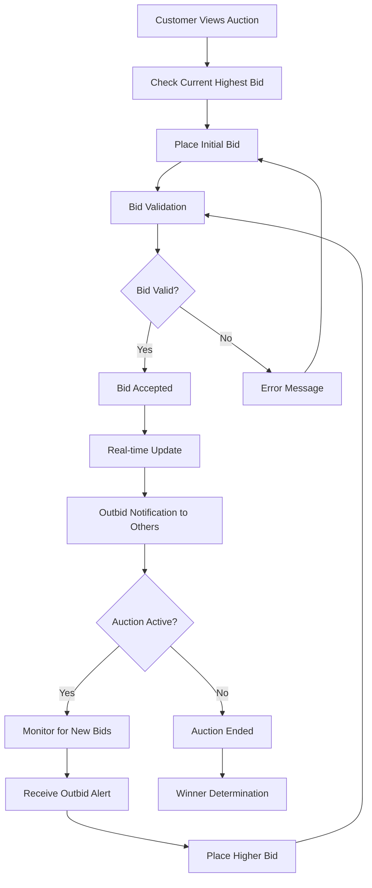
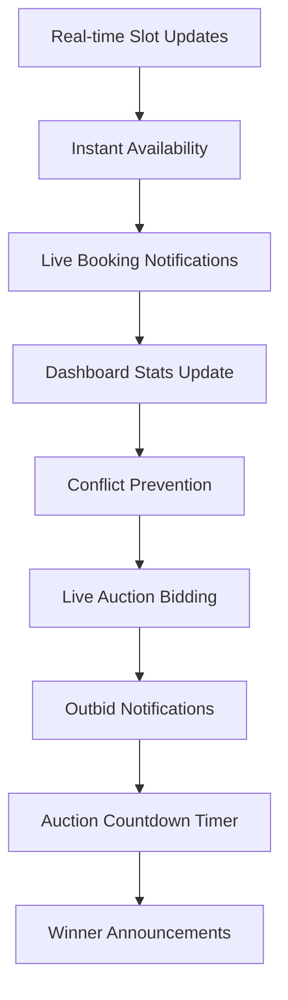

# User Types and Journeys - Worky App (v2)

## Overview

The Worky app has two distinct user types, each with specific roles and workflows within the platform. This document outlines the user types, their journeys, and a user matrix detailing their permissions and capabilities.

## User Types

### 1. Handyman
Service providers who list their availability for last-minute jobs and create auctions for high-demand services.

**Key Characteristics:**
- List spontaneous availability (last-minute free slots)
- Create auctions for premium or high-demand time slots
- Set hourly rates, auction starting prices, and manage earnings
- Receive instant notifications for new bookings and auction bids
- Manage their business profile and skills
- Control auction parameters (duration, minimum bid, reserve price)

### 2. Customer
Users who need immediate help with urgent tasks and participate in auctions created by handymen.

**Key Characteristics:**
- Browse and search available handyman time slots
- Book slots instantly (first-come-first-serve basis)
- Participate in auctions created by handymen for premium services
- Place bids on auction slots with real-time bidding
- Rate and review service providers
- Receive notifications for auction updates and outbid alerts

## User Matrix

| Feature/Permission | Handyman | Customer |
|-------------------|----------|----------|
| User Registration | ✅ | ✅ |
| Profile Management | ✅ | ✅ |
| Create Time Slots | ✅ | ❌ |
| Browse Time Slots | ❌ | ✅ |
| Book Time Slots | ❌ | ✅ |
| View Bookings | ✅ | ✅ |
| Confirm Bookings | ✅ | ❌ |
| Dashboard Access | ✅ | ✅ |
| Earnings Tracking | ✅ | ❌ |
| Payment Processing | ❌ | ✅ |
| Reviews & Ratings | ✅ (receive) | ✅ (give) |
| Create Auctions | ✅ | ❌ |
| Participate in Auctions | ❌ | ✅ |
| Manage Auction Settings | ✅ | ❌ |
| Place Bids | ❌ | ✅ |
| View Auction Results | ✅ | ✅ |

## User Journeys

### 1. Handyman User Journey

The handyman journey focuses on managing availability and creating auctions based on their self-set schedule. Booking is handled separately through calendar integration where customers book directly into the handyman's calendar (typically a month in advance).

**Core Handyman Activities:**
1. **Availability Management**: Set and update calendar availability
2. **Auction Creation**: Create auctions for premium time slots based on availability
3. **Service Delivery**: Complete jobs and manage earnings

### 2. Customer User Journey

The customer journey focuses on finding available services, booking them instantly, or participating in auctions.

Recent updates:
- Customer dashboard quick actions now open the booking creation flow and My Bookings overview without leaving the glass UI context.
- The dedicated bookings screen surfaces upcoming and past services with a detail sheet that supports cancel and reschedule actions against Supabase data.
- The booking creation flow supports filtering by region, skill, and availability window before opening the confirmation sheet.
- Handymen manage availability via calendar modal with slot creation, block, and delete controls synced to customers in realtime.

## Detailed Workflows

### Authentication Flow

Both user types follow the same initial authentication flow:

### Calendar & Auction Flow

The core business logic separates calendar booking from auction functionality:

### Auction Creation Flow

Handymen can create auctions for premium or high-demand time slots:

### Auction Bidding Flow

Customers participate in auctions created by handymen:

### Real-time Features

The app emphasizes real-time updates throughout the experience:

## Key Features by User Type

### Handyman Features:
- **Profile Management**: Business name, hourly rate, location, skills, description
- **Availability Management**: Set and update calendar availability for booking integration
- **Auction Creation**: Create premium auctions based on available time slots
- **Auction Management**: Set starting price, duration, reserve price, and service details
- **Calendar Integration**: Sync with external calendar systems for direct customer booking
- **Auction Monitoring**: Real-time bid tracking and auction performance analytics
- **Dashboard**: Real-time stats (availability status, active auctions, earnings)
- **Real-time Updates**: Live notifications for auction bids and calendar bookings
- **Revenue Optimization**: Leverage auction-based pricing for premium time slots

### Customer Features:
- **Calendar Booking**: Direct booking through handyman's integrated calendar system
- **Auction Discovery**: Browse available auction slots created by handymen
- **Smart Search**: Filter by business name, location, skills, or auction status
- **Auction Participation**: Browse, bid on, and win auction slots
- **Bidding Interface**: Real-time bidding with automatic outbid notifications
- **Auction Monitoring**: Track active bids and auction countdown timers
- **Booking Management**: View calendar bookings and auction wins
- **Real-time Updates**: Live auction bid notifications and calendar availability
- **Profile Management**: Personal information, preferences, and bidding history
- **Budget Management**: Set maximum bid limits and spending controls

## Technical Implementation Details

### Database Schema

The app uses a PostgreSQL database with the following key tables:

- `users`: User accounts with type (handyman/customer)
- `handyman_profiles`: Business information, rates, skills
- `time_slots`: Available appointment slots
- `bookings`: Customer booking records
- `auctions`: Auction system (Phase 2)
- `auction_bids`: Bidding records (Phase 2)

### Security

{{ ... }}
- Row Level Security (RLS) enabled on all tables
- User-specific data access policies
- Secure authentication with Supabase Auth
- Environment variable configuration

## Auction System Implementation (Current Phase)

### Auction Parameters

- **Starting Price**: Minimum bid amount set by handyman
- **Reserve Price**: Optional minimum acceptable winning bid
- **Auction Duration**: Customizable time period (15 minutes to 24 hours)
- **Bid Increment**: Minimum amount by which bids must increase
- **Auto-extend**: Optional feature to extend auction if bids placed in final minutes

### Auction Rules

- Only handymen can create auctions
- Customers must be registered and verified to bid
- Bids are binding commitments
- Highest bidder at auction end wins the slot
- Reserve price must be met for auction to complete
- Handyman can cancel auction before first bid is placed

### Notification System

- Real-time bid notifications to all participants
- Outbid alerts sent immediately to previous highest bidder
- Auction ending reminders (5 minutes, 1 minute warnings)
- Winner and loser notifications upon auction completion
- Handyman notifications for all auction activity

## Future Enhancements

### Phase 3 - Advanced Auction Features
- Proxy bidding (automatic bid increases up to user's maximum)
- Auction categories and specialized services
- Bulk auction creation for recurring services
- Auction analytics and performance insights
- Customer bidding reputation system

### Phase 3 - Payment Integration
- Stripe Connect integration
- Secure payment processing
- Automated payout system
{{ ... }}
- Transaction history and receipts
- Refund management
